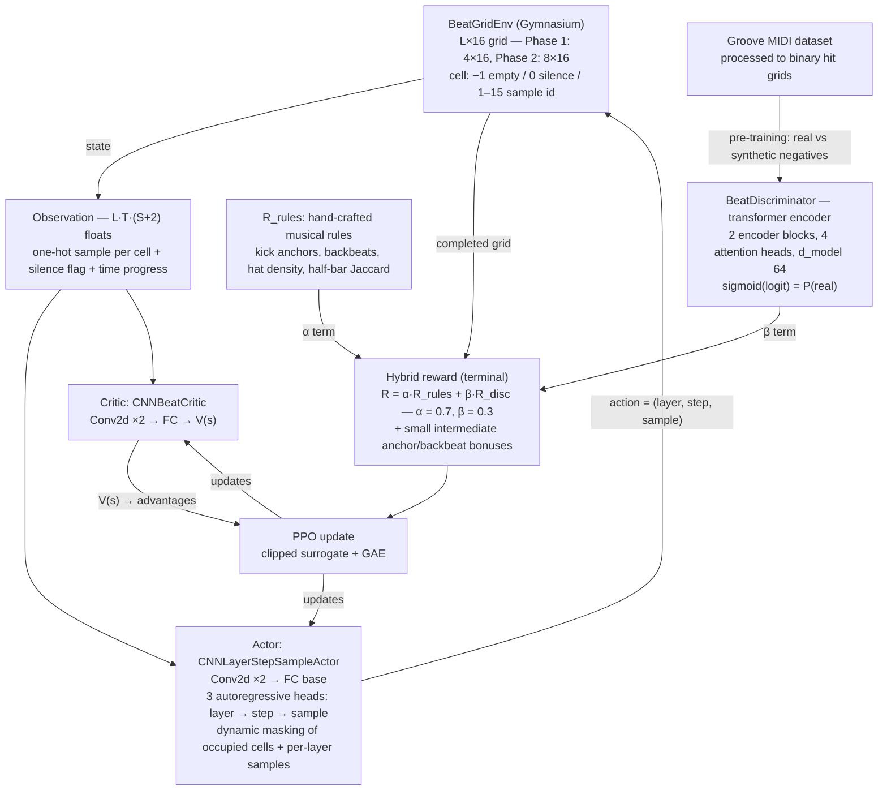

# RL Beat Generation

> A PPO agent that composes drum beats by filling an instrument × time grid cell-by-cell, guided by
> a hybrid reward of hand-crafted musical rules and a transformer discriminator trained on real
> performances.

**CS 5180 Reinforcement Learning · Northeastern University · Spring 2026**  
Atharv Chaudhary · Taha Ucar · Yixun Li


---

## Results

| Result | PPO Agent | Random baseline | Evidence |
|---|---|---|---|
| Phase 1 rule reward (4×16 grid) | **0.9585 ± 0.1330** | 0.4170 ± 0.2129 | [evaluation_report.json](outputs/evaluation_report.json) · [random_baseline_report.json](outputs/random_baseline_report.json) |
| Phase 2 rule reward (8×16 grid, full objective) | **0.5086 ± 0.0212** | 0.3615 ± 0.0802 | [evaluation_report_phase2.json](outputs/evaluation_report_phase2.json) (seed 7) |
| Discriminator validation accuracy | **94.75%** (seeded, evaluation-only rerun) | — | [discriminator_phase1_eval.json](outputs/discriminator_phase1_eval.json) |

The Phase 1 agent reaches **0.96 vs 0.42** rule reward — a **+130% relative improvement** over
random — while producing beats at roughly half the random agent's density (0.4508 vs 0.9438).
Best training reward: 0.942 (epoch 486/500). Phase 2 improves +41% over its baseline but
converged to a documented density-trap optimum — see
[Phase 2: a documented failure](#phase-2-a-documented-failure) below. Full metric tables
(per-layer densities, training progression v1→v3, metric footnotes) are in
[docs/PROGRESS.md](docs/PROGRESS.md#7-detailed-evaluation-results).

---

## Architecture

The system frames beat composition as a sequential MDP over an L×16 grid (L instrument layers × 16
16th-note time steps; Phase 1: 4×16, Phase 2: 8×16). The agent fills one cell per step until all
L×16 cells are assigned.



**Action space factoring.** Instead of sampling from L·T·(S+1) actions flat, the actor decomposes
each decision into three sequential steps — layer → step → sample — reducing effective branching
and letting the architecture encode instrument hierarchy explicitly.

Layer-by-layer network shapes, the exact reward-rule weights, and the observation encoding are in
[docs/PROGRESS.md](docs/PROGRESS.md#8-architecture-details).

---

## Setup

Requirements: Python 3.10. CUDA GPU recommended for training; CPU/MPS is fine for inference.

```bash
git clone https://github.com/Atharv-Girish-Chaudhary/rl-beat-generation.git
cd rl-beat-generation

python3.10 -m venv .venv
source .venv/bin/activate

# Install torch first, per platform:
#   macOS (CPU / MPS) or any non-CUDA system — development and inference:
pip install torch torchvision torchaudio
#   Linux with CUDA (HPC, Colab) — training:
# pip install torch torchvision torchaudio --index-url https://download.pytorch.org/whl/cu128

pip install -r requirements.txt
pip install -e .
```

**Download pretrained weights** (needed for the demo and evaluation — checkpoints are gitignored).
All seven checkpoints (~14 MB) are on the
[v1.0-checkpoints Release](https://github.com/Atharv-Girish-Chaudhary/rl-beat-generation/releases/tag/v1.0-checkpoints):

```bash
gh release download v1.0-checkpoints --repo Atharv-Girish-Chaudhary/rl-beat-generation --dir outputs/checkpoints
```

**Reproduce the reported numbers:**

```bash
python evaluation/evaluate.py --n_episodes 20 --phase 1
python evaluation/evaluate.py --n_episodes 20 --phase 2 --seed 7
python evaluation/evaluate_discriminator.py --seed 7   # writes outputs/discriminator_phase1_eval.json
pytest tests/                                          # 17 tests
```

`requirements.txt` is the single locked dependency source; the local `.venv/` is gitignored.
Retraining from scratch, the Groove MIDI data pipeline, and the SLURM/HPC workflow (a conda env
named `beat_env`, built from the same lockfile) are documented in
[docs/PROGRESS.md](docs/PROGRESS.md#10-hpc-workflow).

---

## Demo


*Left: agent at epoch 0. Right: best Phase 1 checkpoint (epoch 486, reward 0.942). Blue = active
cell, number = sample ID chosen.*

**Listen:** [outputs/beat_sample.wav](outputs/beat_sample.wav) — a Phase 1 beat rendered by
`scripts/generate_audio.py`.

Run the interactive Streamlit demo locally:

```bash
source .venv/bin/activate
pip install streamlit
streamlit run app.py
# Opens at localhost:8501 — sidebar controls: Phase (4×16 / 8×16), BPM, seed, bar count
```

<!-- To add: run the demo, screenshot it, save as docs/img/streamlit_demo.png, then
     uncomment the next line.
 -->

---

## Phase 2: a documented failure

Scaling from 4 to 8 instruments doubled the action space — and the agent regressed into a
density-spam local optimum: it over-fills the grid because the melodic half of its reward sits on
a zero-variance plateau (0.2501 for agent and random alike — no learning signal). The training
plateau (~0.595) was predicted a priori to three significant figures by a first-principles
analysis of the reward landscape. Full root-cause analysis and proposed fixes:
[docs/phase2_diagnostic.md](docs/phase2_diagnostic.md).

---

## Documentation

- [docs/PROGRESS.md](docs/PROGRESS.md) — development log: detailed results, architecture details,
  project structure, HPC workflow, retraining guide, references and citation
- [docs/phase2_diagnostic.md](docs/phase2_diagnostic.md) — Phase 2 root-cause analysis
- [docs/beat_report.tex](docs/beat_report.tex) — technical report (LaTeX)
- [docs/FUTURE_WORK.md](docs/FUTURE_WORK.md) — tracked improvements and research extensions

---

## Team

| Member | Contribution |
|--------|-------------|
| **Atharv Chaudhary** | PPO training loop, discriminator architecture and pre-training, Phase 2 expansion |
| **Taha Ucar** | Gymnasium environment, reward function, action masking |
| **Yixun Li** | Data pipeline (Groove MIDI, Freesound), audio rendering |

---

## License

MIT
