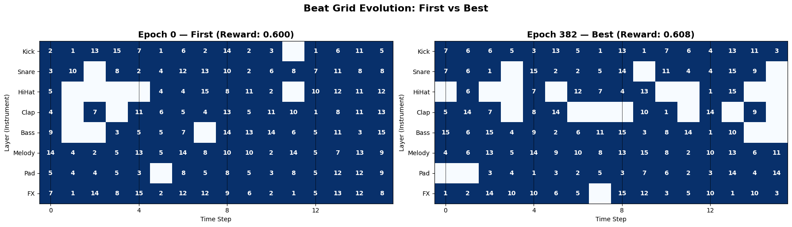
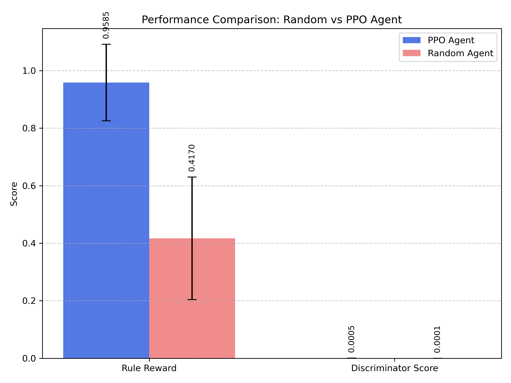

# RL Beat Generation

A PPO agent that composes drum beats by filling a 4×16 grid cell-by-cell, guided by a hybrid reward of hand-crafted musical rules and a transformer discriminator trained on real performances.

**CS 5180 Reinforcement Learning · Northeastern University · Spring 2026**
Atharv Chaudhary · Taha Ucar · Yixun Li

---

## Demo



*Left: agent at epoch 0. Right: best checkpoint (epoch 209, reward 0.779). Blue = active cell, number = sample ID chosen.*

The agent also renders beats to audio. Running `scripts/generate_audio.py` produces a WAV file by
loading the trained actor, running one inference episode, and mixing the instrument samples from
`data/samples/` at 16th-note intervals. A 4-bar loop at 120 BPM is saved to `outputs/beat_sample.wav`.

---

## Architecture

The system frames beat composition as a sequential MDP over a 4×16 grid (4 instrument layers × 16
16th-note time steps). The agent fills one cell per step until all 64 cells are assigned.

```
┌─────────────────────────────────────────────────────────────────────┐
│                          PPO Agent                                   │
│                                                                       │
│   Observation: (L×T×(S+2),) = (1088,) float32                       │
│     • Channels 0–14: one-hot sample index per cell                   │
│     • Channel 15:    silence flag                                     │
│     • Channel 16:    step_count / max_steps  (temporal progress)     │
│                                                                       │
│   ┌──────────────────────────────┐   ┌───────────────────────────┐   │
│   │       CNNLayerStepSampleActor│   │       CNNBeatCritic        │   │
│   │                              │   │                             │   │
│   │  Conv2d(17,32) → ReLU        │   │  Conv2d(17,32) → ReLU      │   │
│   │  Conv2d(32,64) → ReLU        │   │  Conv2d(32,64) → ReLU      │   │
│   │  FC(64·L·T, 128) base        │   │  FC(64·L·T, 128) → ReLU    │   │
│   │                              │   │  FC(128, 1)  →  V(s)        │   │
│   │  ① layer_head  → L logits   │   └───────────────────────────┘   │
│   │  ② step_head   → T logits   │                                    │
│   │     (+ layer embedding)      │                                    │
│   │  ③ sample_head → S+1 logits │                                    │
│   │     (+ step embedding)       │                                    │
│   │                              │                                    │
│   │  Dynamic masking:            │                                    │
│   │  • Occupied cells blocked    │                                    │
│   │  • Wrong-instrument samples  │                                    │
│   │    blocked per layer         │                                    │
│   └──────────────────────────────┘                                   │
└─────────────────────────────────────────────────────────────────────┘
                              │ action: flat int → (layer, step, sample)
                              ▼
┌─────────────────────────────────────────────────────────────────────┐
│                       BeatGridEnv (Phase 1)                          │
│  Grid: (4, 16) int64   −1=empty, 0=silence, 1–15=sample index       │
│  Episode: fill all 64 cells, then terminate                          │
└─────────────────────────────────────────────────────────────────────┘
                              │
                              ▼
┌─────────────────────────────────────────────────────────────────────┐
│                         Hybrid Reward                                 │
│                                                                       │
│   R = α · R_rules  +  β · R_disc                                     │
│       (0.9)              (0.1)    ← Phase 1 weights                  │
│                                                                       │
│   R_rules  (terminal, [0,1]):                                        │
│     +0.1  kick on step 0                                             │
│     +0.1  kick on step 8                                             │
│     +0.1  snare/clap on step 4                                       │
│     +0.1  snare/clap on step 12                                       │
│     +0.2  hi-hat count in [4, 12]                                    │
│     +0.4  Jaccard similarity (first vs second half) in [0.6, 0.95)  │
│     −0.01 per off-beat snare/clap hit                                │
│                                                                       │
│   R_disc  (terminal, [0,1]):                                         │
│     sigmoid( BeatDiscriminator(binary_grid) )                        │
│                                                                       │
│   R_intermediate:  +0.05 for anchor/backbeat hits as they are placed │
└─────────────────────────────────────────────────────────────────────┘
                              │
                              ▼
┌─────────────────────────────────────────────────────────────────────┐
│                       BeatDiscriminator                               │
│  Input: (B, L, T) binary hit grid                                    │
│  token_embed: Linear(L, 64)   +   pos_embed: Embedding(T, 64)       │
│  2× EncoderBlock (MultiHeadAttention(4 heads) + LayerNorm + FFN)    │
│  Classifier: Linear(64, 32) → ReLU → Linear(32, 1) → logit          │
│  Pre-trained on Groove MIDI (real) vs synthetic negatives (fake)     │
└─────────────────────────────────────────────────────────────────────┘
```

**Action space factoring.** Instead of sampling from L·T·(S+1) = 1,024 actions flat, the actor
decomposes each decision into three sequential steps — layer → step → sample — reducing effective
branching and letting the architecture encode instrument hierarchy explicitly.

---

## Results (Final — v3 checkpoint vs Random Baseline)

Evaluated over 20 episodes using `evaluation/evaluate.py` with `actor_best.pth` (v3) and `discriminator_phase1_v2`. Comparison against random uniform action baseline evaluated using `evaluation/evaluate_baseline.py`.

| Metric | Agent (v3) | Random Baseline | Notes |
|--------|------------|-----------------|-------|
| Rule reward | **0.9585 ± 0.1330** | 0.4595 ± 0.2019 | Agent learned to follow musical rules |
| Discriminator score | **0.0005 ± 0.0003** | 0.0001 ± 0.0000 | Both low, but agent learns slightly more structural patterns |
| Beat density | **0.4508 ± 0.0173** | 0.9305 ± 0.0294 | Agent learned restraint vs random noise barrage |
| Groove consistency | **0.3971 ± 0.0332** | 0.8641 ± 0.0643 | Random is artificially high due to density |



**Per-layer density:**

| Instrument | Density | Interpretation |
|------------|---------|----------------|
| Kick | **0.9969 ± 0.0136** | Dense anchor — correct |
| Snare | **0.1844 ± 0.0503** | Learned restraint (was 0.97 in v1) |
| HiHat | **0.4844 ± 0.0762** | Balanced |
| Clap | **0.1375 ± 0.0250** | Very sparse — musically realistic |

**Training progression:**

| Run | Config | Best Reward |
|-----|--------|-------------|
| v1 | α=0.9, β=0.1, 250 ep, weak disc | 0.825 |
| v2 | α=0.6, β=0.4, 250 ep, weak disc | 0.779 |
| **v3 (final)** | **α=0.7, β=0.3, 500 ep, disc v2** | **0.942** |

---

## Demo

### Streamlit App
Run the interactive demo locally:
```bash
conda activate rl-beats
pip install streamlit
streamlit run app.py
```

Opens at `localhost:8501`. Controls:
- **BPM** — tempo (60–180)
- **Seed** — reproducible beat generation
- **N Bars** — loop length (1–8)

Click "Generate Beat" to generate a grid, hear the audio, and see evaluation metrics live.

---

## Current Status

- Phase 1 complete — PPO agent trained, audio generation working, Streamlit demo live
- Phase 2 (8×16 grid) and SAC agent (audio FX) are out of scope for this submission

---

## Project Structure

```
rl-beat-generation/
├── app.py                                # Streamlit interactive demo
├── beat_rl/                              # Installable package
│   ├── env/
│   │   ├── beat_env.py                   # BeatGridEnv (Gymnasium, Phase 1)
│   │   ├── reward.py                     # compute_reward() — rules + discriminator
│   │   └── visualize_env.py              # Matplotlib grid heatmap
│   └── models/
│       ├── actor.py                      # CNNLayerStepSampleActor (3-head autoregressive)
│       ├── critic.py                     # CNNBeatCritic (V(s) → scalar)
│       └── discriminator.py              # BeatDiscriminator (transformer encoder)
│
├── scripts/
│   ├── train_ppo.py                      # PPO training loop (Phase 1)
│   ├── train_discriminator.py            # Discriminator pre-training
│   ├── process_groove.py                 # Groove MIDI → (N, L, T) binary grids
│   ├── download_samples.py               # Freesound API sample downloader
│   └── generate_audio.py                 # Actor inference → WAV rendering
│
├── evaluation/
│   ├── evaluate.py                       # N-episode eval: rule reward, density, groove
│   └── evaluate_baseline.py              # Random baseline evaluation and comparison
│
├── notebooks/
│   ├── train_ppo_colab.ipynb             # Colab PPO training notebook (T4/A100)
│   ├── train_discriminator_colab.ipynb   # Colab discriminator training notebook
│   ├── discriminator_model.ipynb         # Discriminator architecture exploration
│   └── discriminator_notes.ipynb         # Discriminator research notes
│
├── data/
│   ├── processed/groove_grids.npy        # Pre-processed Groove MIDI grids
│   ├── raw/groove/                       # Groove MIDI dataset
│   └── samples/                          # Freesound WAV samples
│       ├── kick/   (30 samples)
│       ├── snare/  (30 samples)
│       ├── hihat/  (25 samples)
│       ├── clap/   (20 samples)
│       ├── bass/, melody/, pad/, fx/
│       └── {layer}/metadata.json         # ID → filename mapping
│
├── outputs/
│   ├── checkpoints/
│   │   ├── actor_best.pth                # Best Phase 1 actor weights (v3, epoch 486)
│   │   ├── actor_best_v3.pth             # v3 actor checkpoint copy
│   │   ├── critic_best.pth               # Best Phase 1 critic weights
│   │   ├── critic_best_v3.pth            # v3 critic checkpoint copy
│   │   ├── discriminator_phase1_v2.pt    # Discriminator v2 (95.12% val accuracy)
│   │   └── discriminator_v1.pt           # Discriminator v1
│   ├── plots/
│   │   ├── baseline_comparison.png       # Bar chart comparing agent vs baseline metrics
│   │   ├── beat_grid_epoch_*.png         # Per-epoch beat grid snapshots
│   │   ├── first_vs_best_comparison.png  # Epoch 0 vs best checkpoint comparison
│   │   └── ppo_training_plot.png         # Training reward curve
│   ├── beat_sample.wav                   # Most recent generated beat
│   ├── evaluation_report.json           # Latest agent evaluation results
│   └── random_baseline_report.json      # Latest baseline evaluation results
│
├── tests/                                # 17 unit + integration tests (all pass)
│   ├── test_actor.py
│   ├── test_beat_env.py
│   ├── test_critic.py
│   ├── test_discriminator.py
│   ├── test_download_samples.py
│   ├── test_integration.py
│   ├── test_process_groove.py
│   ├── test_reward.py
│   └── conftest.py
│
├── configs/
│   ├── ppo_phase1.yaml
│   └── discriminator.yaml
├── docs/rl_beat_gen_level1_guide.md
├── environment.yml
├── requirements.txt
└── setup.py
```

---

## Setup

**Requirements:** Python 3.10, CUDA GPU (recommended), Freesound API key for downloading new samples.

```bash
git clone https://github.com/Atharv-Girish-Chaudhary/rl-beat-generation.git
cd rl-beat-generation

conda create -n beat_env python=3.10
conda activate beat_env

pip install torch torchvision torchaudio --index-url https://download.pytorch.org/whl/cu118
pip install -e .
```

Checkpoints and processed data are committed to the repo — no data pipeline step is required to
run inference or evaluation.

---

## Usage

**Retrain from scratch** (pre-trained discriminator already included):

```bash
python scripts/train_ppo.py
# Saves actor_best.pth, critic_best.pth to outputs/checkpoints/
# Saves training curves and grid PNGs to outputs/plots/
```

**Generate a beat:**

```bash
python scripts/generate_audio.py --seed 42 --bpm 120 --n_beats 4
# Writes outputs/beat_sample.wav
```

**Evaluate the checkpoint:**

```bash
python evaluation/evaluate.py --n_episodes 20
# Prints summary table, writes outputs/evaluation_report.json
```

**Evaluate the random baseline:**

```bash
python evaluation/evaluate_baseline.py --n_episodes 20
# Prints summary table, writes outputs/random_baseline_report.json and outputs/plots/baseline_comparison.png
```

**Retrain the discriminator** (requires Groove MIDI dataset):

```bash
wget https://storage.googleapis.com/magentadata/datasets/groove/groove-v1.0.0-midionly.zip
unzip groove-v1.0.0-midionly.zip -d data/raw/groove
python scripts/process_groove.py          # → data/processed/groove_grids.npy
python scripts/train_discriminator.py     # → outputs/checkpoints/discriminator_best.pth
```

**Colab training** (recommended for GPU access):

Open `notebooks/train_ppo_colab.ipynb`. Set runtime to T4 GPU. All config is in Cell 3.

---

## Team

| Member | Contribution |
|--------|-------------|
| **Atharv Chaudhary** | PPO training loop, discriminator architecture and pre-training |
| **Taha Ucar** | Gymnasium environment, reward function, action masking |
| **Yixun Li** | Data pipeline (Groove MIDI, Freesound), audio rendering |

---

## References

- Schulman et al., [Proximal Policy Optimization Algorithms](https://arxiv.org/abs/1707.06347) (2017)
- Gillick et al., [Learning to Groove with Inverse Sequence Transformations](https://arxiv.org/abs/1905.06118) (2019) — Groove MIDI Dataset
- Vaswani et al., [Attention Is All You Need](https://arxiv.org/abs/1706.03762) (2017)

---

## License

MIT
